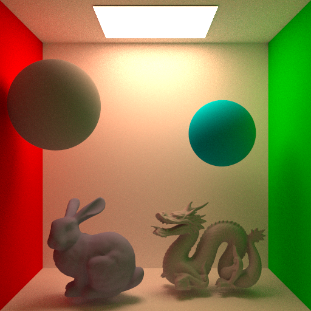
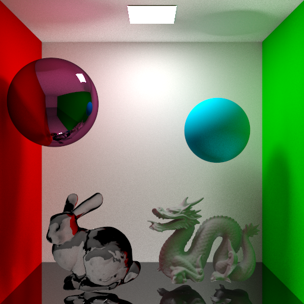

# Global Illumination

Monte-Carlo path tracing for global illumination.


## Features

- Acceleration structure: uniform grid
- Soft shadow and indirect lighting
- Surface reflection with perfect diffusion, specular and transmission effects
- OpenMP for multi-threading rendering


## Usage

### Compilation

We utilize *cmake* as the project building tool. In case your environment is not compatible with OpenMP, we offer a macro named `NO_OMP` to enable/disable OpenMP in the cmake generation step:

```bash
# Suppose your present working directory is Coding/build/

# Enable OpenMP
cmake -DNO_OMP=0 ..

# Disable OpenMP
cmake -DNO_OMP=1 ..
```

### Execution

Once you manage to compile the project, you can run your ray tracing via typing the command below.

```bash
# Suppose your present working directory is Coding/build/

./rayTracing ../configs/config_all_diff.txt
```

The "config_all_diff.txt" is a configuration file for rendering diffusion-only scenes, where you can specify the number of available threads, samples per pixel, camera/light settings, output resolutions, etc. It is a plain-text file, where each option is stored in the format `key value`.


## Demo





## Third-party Libraries

- OpenMP
- Eigen (included in 3rdLibs/)
- [progressbar](https://github.com/gipert/progressbar) (included in 3rdLibs/)
- stb_image_write (included in 3rdLibs/)


## License

[The GNU General Public License v3.0](https://www.gnu.org/licenses/gpl-3.0.en.html)

